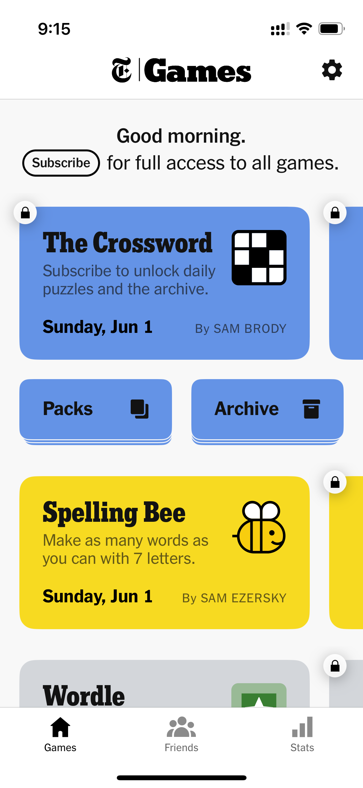
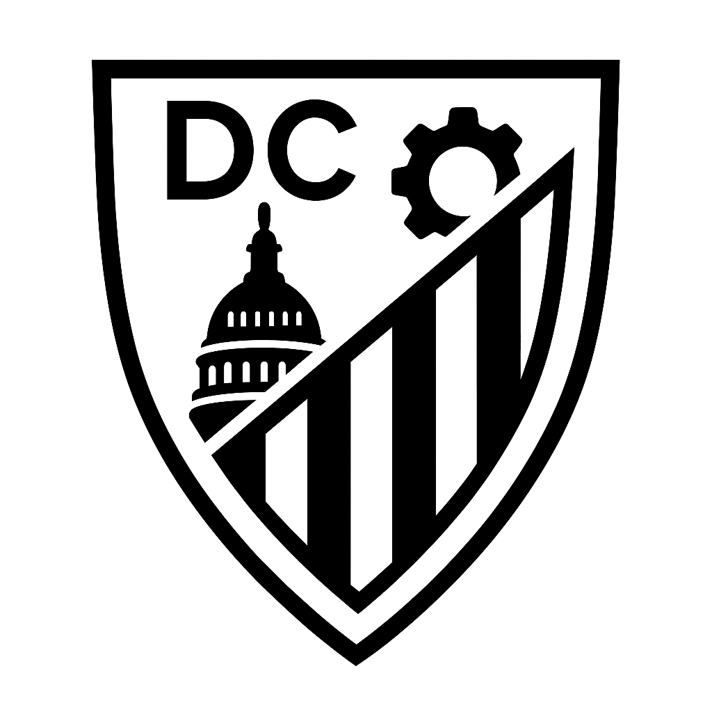

# NYTGames-SwiftUI-Clone
Cloning the NYT Games UI using SwiftUI

## Cloning

- Created a new project, using standard iOS App template.
- Titled the app `Games`, with organization identifier `com.dc-engineer`.
- Kept interface as `SwiftUI`, with no storage.
- Did not create a git repository on my Mac, because I had already created one on GitHub.

### Games Page

- Created a new SwiftUI view file called `GamesPage.swift`
- Replaced code in `ContentView.swift` to reference this new view.
```swift
struct ContentView: View {
    var body: some View {
        GamesPage()
    }
}
```

#### Reference Image



#### Title Bar

- NYT is proprietary, can't use it.
- Requested ChatGPT to provide a simplified version of my [DC-Engineer.com](https://www.dc-engineer.com/) logo.
- Removed background in Preview using Instant Alpha, then scaled down to 48x48 and 72x72 for image assets in the app.
- Create new image set in the app `Assets`, titled "dc," which I can then access as `Image(.dc)` in SwiftUI.
  


- Create a new header view as a function inside the `GamesPage` view class.

```swift
func header() -> some View {
    HStack(spacing: 0) {
        Image(.dc)
            .resizable()
            .frame(width: Constants.headerFontSize, height: Constants.headerFontSize)
        Rectangle()
            .frame(width: 1, height: 24)
            .padding(.horizontal, 2)
        Text("Games")
    }
    .font(.custom("Times", size: Constants.headerFontSize, relativeTo: .title))
    .fontWeight(.black)
}
```

- Since I am reusing the same size for both the image and text, place this in a `Constants` structure, also inside `GamesPage`.

```swift
private struct Constants {
    static let headerFontSize: CGFloat = 34
}
```

- Also create the gear icon button that shows up in the top-right corner, for now with an empty action.

```swift
func settingsButton() -> some View {
    Button("Settings", systemImage: "gearshape.fill") { }
        .tint(.primary)
}
```

- We are going to make use of the navigation toolbar, that requires us wrapping our `GamesPage` content inside of a `NavigationStack`.
- Expecting that later we will need a `ScrollView` and `VStack` to display our main content, we insert those inside the `NavigationStack`, empty for now.
- Add the `.toolbar` modifier, with `ToolbarItem`s representing the header and settings button, at principal and trailing placement, respectively.
- To align with the NYT app's appearance, we use three additional modifiers (note, these work on iOS 18+)
  * `.inline` display mode assures that the title bar is consistently shrunk down to the space at the top.
  * `.background` makes the color be pure white when in light mode, rather than the grayish default.
  * The `toolbarBackgroundVisibility` modifier makes the subtle divider line appear. This is not exactly what you'd expect from the syntax, but it works.

```swift
var body: some View {
    NavigationStack {
        ScrollView {
            VStack {
                /* Games content will go here */
            }
        }
        .toolbar {
            ToolbarItem(placement: .principal, content: header)
            ToolbarItem(placement: .navigationBarTrailing, content: settingsButton)
        }
        .navigationBarTitleDisplayMode(.inline)
        .toolbarBackground(.background)
        .toolbarBackgroundVisibility(.visible, for: .navigationBar)
    }
}
```
