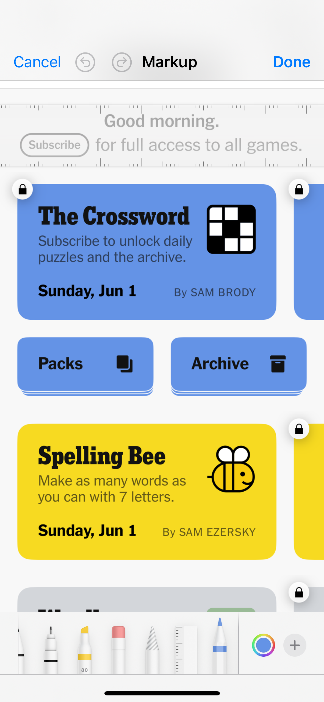
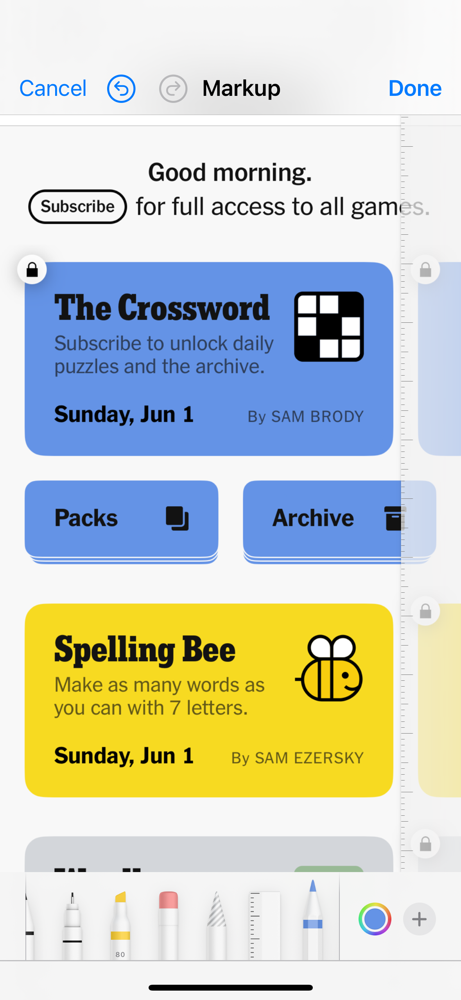
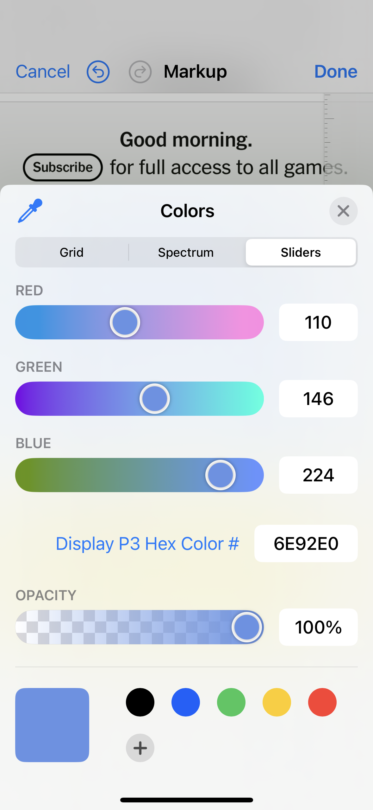

# NYTGames-SwiftUI-Clone
This git repo supports a series of blog posts in which I am imitating the NYT Games interface using SwiftUI.
Those posts, on my website [DC-Engineer.com](DC-Engineer.com), will cover the steps in detail, while here I will host the source code and snapshots.

## Post 1: Creating the Header
The very first post on this project highlights the creation of the app project, adding custom icons and fonts, and creating the header at the top of the app screen.
Read more [on the blog](https://www.dc-engineer.com/imitating-nyt-games-with-swiftui-part-1-the-header/).

## Post 2: Game Tiles
The second post covers the creation of tiles, which are the large buttons on the main page that links to the individual games.
A series of vertical and horizontal stacks are used to layout the tiles, then frames, padding, and backgrounds are used to give it shape.
Template tiles are finally added to the main games page.
Read more [on the blog](https://www.dc-engineer.com/imitating-nyt-games-with-swiftui-part-2-tiles/).

## Post 3: Styling and Branding

### Measuring Dimension and Color
- Photos app can be used to measure dimension and color
- Tap the "edit" icon (three horizontal bars with dots on the bottom) and then the "markup" icon (pen tip at the top
- Scroll to the right to see the ruler, which won't modify the image, but can be positioned and rotated
- Tap the colored circle icon in the lower right once to open the color picker, then click the eye dropper icon in the upper left of the sheet
- Drag to the color you want to identify in the image, sheet will pop up again with RGBA and hex color codes, we'll use the hex

| Measure Width                       | Measure Height                        | Get Color Hex                          |
|-------------------------------------|---------------------------------------|----------------------------------------|
|  |  |  | 

- We can see in the third example image the measured color hex for the blue used in the Crossword tile is `6E92E0`, we'll use this format as its a little easier to type than all three RGB values individually
- I repeated this measurement process with each of the colors recognizable in the tiles

| Color Name          | Color Hex |
|---------------------|-----------|
| `crosswordBlue`     | `6E92E0`  |
| `spellingbeeYellow` | `F2DB50`  |
| `spellingbeeOrange` | `F1CF48`  |
| `wordleGray`        | `D4D6DA`  |
| `worldeGreen`       | `4B7C3C`  |
| `connectionsPurple` | `AFA7F3`  |
| `connectionsViolet` | `B174BF`  |
| `strandsTeal`       | `BBDDD8`  |
| `strandsYellow`     | `E9CA4F`  |
| `strandsBlue`       | `B6E3F0`  |
| `sudokoOrange`      | `EE9F38`  |
| `miniBlue`          | `9DBDF5`  |
| `miniBlueDark`      | `2E5CCD`  |
| `letterboxedRed`    | `EB7970`  |
| `letterboxedRedVar` | `CF2E3D`  |
| `tilesGreen`        | `BEE269`  |
| `tilesTeal`         | `80E68E`  |
| `tilesTealVar`      | `61A391`  |

### Creating Color Assets
- In XCode, click on the assets on the left hand panel, then the plus icon on the bottom of the assets content, select color set, and name our first "crosswordBlue"
- Click the "Any Appearance" icon, which should make an editor available on the right (you may need to tap the icon in the upper right of the window to open the editor panel).
- In the color editor on the bottom right, select "8 bit hexadecimal"
