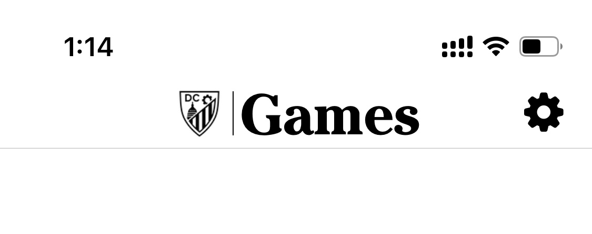
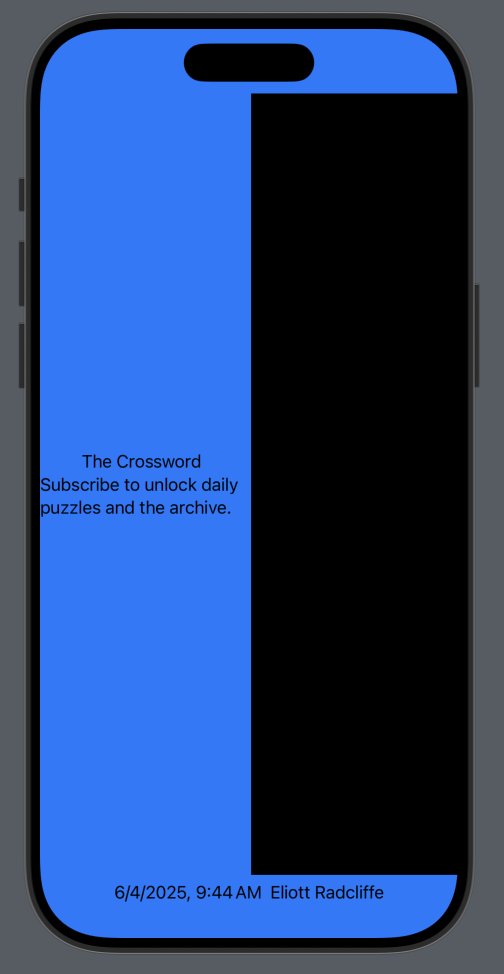
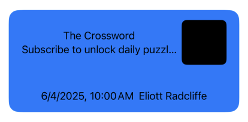
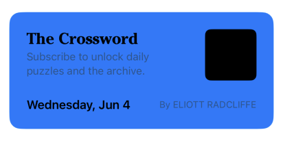
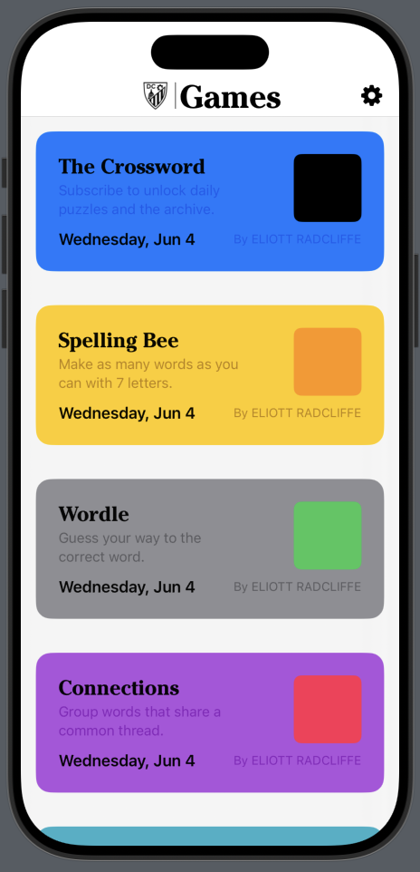

# NYTGames-SwiftUI-Clone
This git repo supports a series of blog posts in which I am imitating the NYT Games interface using SwiftUI.
Those posts, on my website [DC-Engineer.com](DC-Engineer.com), will cover the steps in detail, while here I will host the source code and snapshots.

## Post 1: Creating the Header
The very first post on this project highlights the creation of the app project, adding custom icons and fonts, and creating the header at the top of the app screen.
Read more [on the blog](https://www.dc-engineer.com/imitating-nyt-games-with-swiftui-part-1-the-header/).


## Post 2: Game Tiles
Post on the blog is upcoming, stay tuned

### Create the File and Placeholders

- New -> File From Template -> SwiftUI View, name it "GameTileView"
- Start with a large tile, which include:
  * Title `Text` in the upper left, using the custom Cheltenham font
  * Caption `Text` underneath the title, in smaller secondary text
  * Date as formatted `Text` on the lower left, in a bolded sans font
  * Author name `Text` as in the lower right, as capitalized secondary text
  * Background `Color`
  * Icon `View` on the right
- Create the constants at the top of the view structure, including defining the `GameIcon` as a generic view
- Also add placeholders in the preview

```swift
struct GameTileView<GameIcon: View>: View {
    let title: String
    let caption: String
    let date: Date
    let author: String
    let background: Color
    let icon: () -> GameIcon
    
    var body: some View {
        Text(/*@START_MENU_TOKEN@*/"Hello, World!"/*@END_MENU_TOKEN@*/) // Will replace with our code
    }
}

#Preview {
    GameTileView(
        title: "The Crossword",
        caption: "Subscribe to unlock daily puzzles and the archive.",
        date: .now,
        author: "Eliott Radcliffe",
        background: .blue,
        icon: { Color.black }
    )
}
```

- Inside the `body` of our view, we can build up the view scaffold

```swift
VStack {
    HStack {
        VStack {
            Text(title)
            Text(caption)
        }
        icon()
    }
    HStack {
        Text(date.formatted())
        Text(author)
    }
}
.background(background)
```

- This won't look much like the actual tile just yet, but you can see the items 



### Add Frames, Padding, and Rounded Corners

- We want to restrict the height of the tile, and the size of the icon, add dimensions as constants at the bottom of the `GameTileView` (ballpark)

```swift
// MARK: - Constants

private let paddingWidth: CGFloat = 24
private let tileHeight: CGFloat = 164
private let tileCornerRadius: CGFloat = 16
private let iconSize: CGFloat = 72
private let iconCornerRadius: CGFloat = 8
```

- Below the main `VStack`, where we previously attached the `.background(background)` modifier

```swift
VStack {
    /* other view components */
}
.padding(paddingWidth)
.frame(maxWidth: .infinity, maxHeight: tileHeight)
.background {
    RoundedRectangle(cornerRadius: tileCornerRadius).fill(background)
}
```

- Attach frame, clip, and padding modifiers to the icon

```swift
icon()
    .frame(width: iconSize, height: iconSize)
    .clipShape(.rect(cornerRadius: iconCornerRadius))
    .padding(.leading, paddingWidth)
```



### Fonts and Formatting

- Attach font and color modifiers to the caption text
- Fixed size modifier ensures proper wrapping of the caption

```swift
VStack(alignment: .leading) {
    Text(title)
        .font(.custom("CheltenhamStd-Bold", size: 22, relativeTo: .title2))
    Text(caption)
        .font(.subheadline)
        .foregroundColor(.secondary)
}
.fixedSize(horizontal: false, vertical: true)
```

- Then modify the date format modifier, add the "By " string in front of the author name, which is uppercased, and add font modifiers
- Include a spacer to push the date and author to the edges of the HStack
- The two author `Text` views are added together, and placed inside a parantheses so we can give them the same modifiers
- Once again, fixedSize modifier ensures proper wrapping

```swift
HStack {
    Text(date.formatted(.dateTime.weekday(.wide).month(.abbreviated).day()))
        .font(.headline)
    Spacer()
    ( Text("By ") + Text(author.uppercased()) )
        .font(.footnote)
        .foregroundColor(.secondary)
}
.fixedSize(horizontal: false, vertical: true)
```



### Adding to the `GamesPage`

- Create a set of presets representing each of the games that use the large tile format

```swift
extension GameTileView {
    
    // MARK: - Presets
    
    static var crossword: some View {
        GameTileView<Color>(
            title: "The Crossword",
            caption: "Subscribe to unlock daily puzzles and the archive.",
            date: .now,
            author: "Eliott Radcliffe",
            background: .blue,
            icon: { Color.black }
        )
    }
    
    static var spellingBee: some View {
        GameTileView<Color>(
            title: "Spelling Bee",
            caption: "Make as many words as you can with 7 letters.",
            date: .now,
            author: "Eliott Radcliffe",
            background: .yellow,
            icon: { Color.orange }
        )
    }
    
    static var wordle: some View {
        GameTileView<Color>(
            title: "Wordle",
            caption: "Guess your way to the correct word.",
            date: .now,
            author: "Eliott Radcliffe",
            background: .gray,
            icon: { Color.green }
        )
    }
    
    static var connections: some View {
        GameTileView<Color>(
            title: "Connections",
            caption: "Group words that share a common thread.",
            date: .now,
            author: "Eliott Radcliffe",
            background: .purple,
            icon: { Color.pink }
        )
    }
    
    static var theMini: some View {
        GameTileView<Color>(
            title: "The Mini",
            caption: "Solve the puzzle in seconds.",
            date: .now,
            author: "Eliott Radcliffe",
            background: .teal,
            icon: { Color.blue }
        )
    }
}
```

- In `GamesPage.swift`, replace the content in the primary `VStack` with the set of presets

```swift
VStack(spacing: 36) {
    GameTileView<Color>.crossword
    GameTileView<Color>.spellingBee
    GameTileView<Color>.wordle
    GameTileView<Color>.connections
    GameTileView<Color>.theMini
}
.padding()
```


