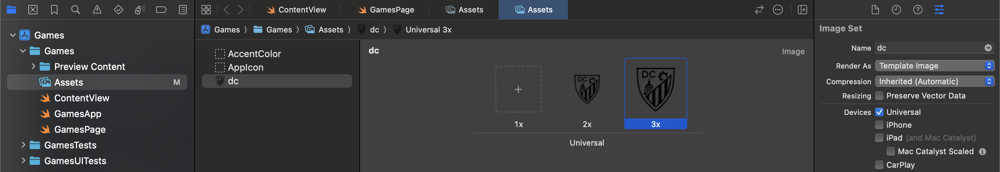

# NYTGames-SwiftUI-Clone
Imitating the NYT Games UI using SwiftUI

## Cloning

- Created a new project, using standard iOS App template.
- Titled the app `Games`, with organization identifier `com.dc-engineer`.
- Kept interface as `SwiftUI`, with no storage.
- Did not create a git repository on my Mac, because I had already created one on GitHub.

### Games Page

- Created a new SwiftUI view file called `GamesPage.swift`
- Replaced code in `ContentView.swift` to reference this new view.
```swift
struct ContentView: View {
    var body: some View {
        GamesPage()
    }
}
```

#### Reference Image


#### Title Bar

- NYT is proprietary, can't use it.
- Requested ChatGPT to provide a simplified version of my [DC-Engineer.com](https://www.dc-engineer.com/) logo.


- Removed background in Preview using Instant Alpha, then scaled down to 48x48 and 72x72 for image assets in the app.
- Create new image set in the app `Assets`, titled "dc," selecte "Render As: Template" in the inspector on the right hand side, now can access as `Image(.dc)` in SwiftUI.



- Create a new header view as a function inside the `GamesPage` view class.

```swift
func header() -> some View {
    HStack(spacing: 4) {
        Image(.dc)
            .resizable()
            .frame(width: Constants.headerFontSize, height: Constants.headerFontSize)
        Rectangle()
            .frame(width: 0.5, height: 28)
        Text("Games")
    }
    .font(.custom("Times", size: Constants.headerFontSize, relativeTo: .title))
    .fontWeight(.black)
}
```

- Since I am reusing the same size for both the image and text, place this in a `Constants` structure, also inside `GamesPage`.

```swift
private struct Constants {
    static let headerFontSize: CGFloat = 34
}
```

- Also create the gear icon button that shows up in the top-right corner, for now with an empty action.

```swift
func settingsButton() -> some View {
    Button("Settings", systemImage: "gearshape.fill") { }
        .tint(.primary)
}
```

- We are going to make use of the navigation toolbar, that requires us wrapping our `GamesPage` content inside of a `NavigationStack`.
- Expecting that later we will need a `ScrollView` and `VStack` to display our main content, we insert those inside the `NavigationStack`, empty for now.
- Add the `.toolbar` modifier, with `ToolbarItem`s representing the header and settings button, at principal and trailing placement, respectively.
- To align with the NYT app's appearance, we use three additional modifiers (note, these work on iOS 18+)
  * `.inline` display mode assures that the title bar is consistently shrunk down to the space at the top.
  * `.background` makes the color be pure white when in light mode, rather than the grayish default.
  * The `toolbarBackgroundVisibility` modifier makes the subtle divider line appear. This is not exactly what you'd expect from the syntax, but it works.

```swift
var body: some View {
    NavigationStack {
        ScrollView {
            VStack {
                /* Games content will go here */
            }
        }
        .toolbar {
            ToolbarItem(placement: .principal, content: header)
            ToolbarItem(placement: .navigationBarTrailing, content: settingsButton)
        }
        .navigationBarTitleDisplayMode(.inline)
        .toolbarBackground(.background)
        .toolbarBackgroundVisibility(.visible, for: .navigationBar)
    }
}
```

- NYT uses a custom version of a Cheltenham font for their header, I downloaded a [free version](https://www.cdnfonts.com/itc-cheltenham-std.font) that doesn't exactly match it, but I thought I'd demo the process with it anyway.
- Follow along with [Apple's guidance](https://developer.apple.com/documentation/swiftui/applying-custom-fonts-to-text/).
- In the app, I right clicked on my app on the left side and selected "New Folder," which I titled "Fonts".
- Then I right clicked on the Fonts folder and selected "Add Files," then navigated to a file I downloaded titled `CheltenhamStdBold.otf`.
- When adding it, make sure your app target is selected, which it should be by default.


- To use the custom font in the app, you must create a "Fonts provided by application" field in the info tab


- The value should be  `CheltenhamStdBold.otf`.
- Confusingly, not `Fonts/CheltenhamStdBold.otf` as the Apple documentation would suggest, this would result in "File not found" errors, iOS appears to flatten the directory structure at build time, so you don't include the subfolder.


- In this particular font, accessing it in SwiftUI was not simply its file name, rather, I needed to determine its PostScript name.
- You can determine the Postscript name by adding the `.otf` file as a system font in the FontBook app, which is usually the default if you double click it in Finder.


- The modified code that accesses this font is below.
- Note the padding modifier that I added to the games text, which I don't like, but I needed to properly align the custom font with the other content.

```swift
func header() -> some View {
    HStack(spacing: 4) {
        Image(.dc)
            .resizable()
            .frame(width: Constants.headerFontSize, height: Constants.headerFontSize)
        Rectangle()
            .frame(width: 0.5, height: 28)
        Text("Games")
            .padding(.top, 12)
    }
    .font(.custom("CheltenhamStd-Bold", size: Constants.headerFontSize, relativeTo: .title))
}
```

- The completed header, imitating the NYT games style, is shown below.


