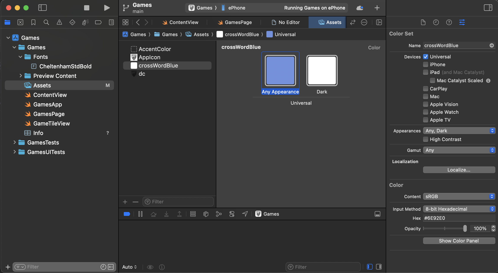
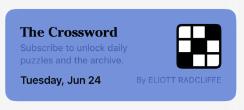

# NYTGames-SwiftUI-Clone
This git repo supports a series of blog posts in which I am imitating the NYT Games interface using SwiftUI.
Those posts, on my website [DC-Engineer.com](DC-Engineer.com), will cover the steps in detail, while here I will host the source code and snapshots.

## Post 1: Creating the Header
The very first post on this project highlights the creation of the app project, adding custom icons and fonts, and creating the header at the top of the app screen.
Read more [on the blog](https://www.dc-engineer.com/imitating-nyt-games-with-swiftui-part-1-the-header/).


## Post 2: Game Tiles
The second post covers the creation of tiles, which are the large buttons on the main page that links to the individual games.
A series of vertical and horizontal stacks are used to layout the tiles, then frames, padding, and backgrounds are used to give it shape.
Template tiles are finally added to the main games page.
Read more [on the blog](https://www.dc-engineer.com/imitating-nyt-games-with-swiftui-part-2-tiles/).


## Post 3: Styling and Branding

### Measuring Dimension and Color
- Photos app can be used to measure dimension and color
- Tap the "edit" icon (three horizontal bars with dots on the bottom) and then the "markup" icon (pen tip at the top
- Scroll to the right to see the ruler, which won't modify the image, but can be positioned and rotated
- Tap the colored circle icon in the lower right once to open the color picker, then click the eye dropper icon in the upper left of the sheet
- Drag to the color you want to identify in the image, sheet will pop up again with RGBA and hex color codes, we'll use the hex

| Measure Width                       | Measure Height                        | Get Color Hex                          |
|-------------------------------------|---------------------------------------|----------------------------------------|
|  |  |  | 

- We can see in the third example image the measured color hex for the blue used in the Crossword tile is `6E92E0`, we'll use this format as its a little easier to type than all three RGB values individually
- I repeated this measurement process with each of the colors recognizable in the tiles

| Color Name          | Color Hex |
|---------------------|-----------|
| `crosswordBlue`     | `6E92E0`  |
| `spellingbeeYellow` | `F2DB50`  |
| `spellingbeeOrange` | `F1CF48`  |
| `wordleGray`        | `D4D6DA`  |
| `wordleGreen`       | `4B7C3C`  |
| `connectionsPurple` | `AFA7F3`  |
| `connectionsViolet` | `B174BF`  |
| `strandsTeal`       | `BBDDD8`  |
| `strandsYellow`     | `E9CA4F`  |
| `strandsBlue`       | `B6E3F0`  |
| `sudokoOrange`      | `EE9F38`  |
| `miniBlue`          | `9DBDF5`  |
| `miniBlueVar`       | `2E5CCD`  |
| `letterboxedRed`    | `EB7970`  |
| `letterboxedRedVar` | `CF2E3D`  |
| `tilesGreen`        | `BEE269`  |
| `tilesTeal`         | `80E68E`  |
| `tilesTealVar`      | `61A391`  |

### Creating Color Assets
- In XCode, click on the assets on the left hand panel, then the plus icon on the bottom of the assets content, select color set, and name our first `crosswordBlue`, as in the first column of the table
- Click the "Any Appearance" icon, which should make an editor available on the right (you may need to tap the icon in the upper right of the window to open the editor panel).
- In the color editor on the bottom right, select "8 bit hexadecimal" and enter the code `6E92E0`.
- Repeat with all the items in the table.


 
- By placing these into color assets, we can access them as static variables in the Color class
- Modify the previews to reference these colors

```swift
extension GameTileView {
    
    // MARK: - Presets

    static var crossword: some View {
        GameTileView<Color>(
            title: "The Crossword",
            caption: "Subscribe to unlock daily puzzles and the archive.",
            date: .now,
            author: "Eliott Radcliffe",
            background: .crossWordBlue,
            icon: { Color.black }
        )
    }
    
    static var spellingBee: some View {
        GameTileView<Color>(
            title: "Spelling Bee",
            caption: "Make as many words as you can with 7 letters.",
            date: .now,
            author: "Eliott Radcliffe",
            background: .spellingbeeYellow,
            icon: { Color.spellingbeeOrange }
        )
    }
    
    static var wordle: some View {
        GameTileView<Color>(
            title: "Wordle",
            caption: "Guess your way to the correct word.",
            date: .now,
            author: "Eliott Radcliffe",
            background: .wordleGray,
            icon: { Color.wordleGreen }
        )
    }
    
    static var connections: some View {
        GameTileView<Color>(
            title: "Connections",
            caption: "Group words that share a common thread.",
            date: .now,
            author: "Eliott Radcliffe",
            background: .connectionsPurple,
            icon: { Color.connectionsViolet }
        )
    }
    
    static var theMini: some View {
        GameTileView<Color>(
            title: "The Mini",
            caption: "Solve the puzzle in seconds.",
            date: .now,
            author: "Eliott Radcliffe",
            background: .miniBlue,
            icon: { Color.miniBlueVar }
        )
    }
}
```


### Creating the Crossword Icon

- Create a new "feature" folder titled Crossword
- Inside that folder create a new SwiftUI view called `CrosswordIcon.swift`, as well as a second SwiftUI view called `CrosswordTile.swift`
- To better visualize our previews, we're also going to create a utility view in the Preview Content folder called `GameIconPreview.swift`
- In the latter, create the code to clip to the standard icon size and shape

```swift
struct GameIconPreview<GameIcon: View>: View {
    let icon: () -> GameIcon
    
    var body: some View {
        icon()
            .frame(width: 72, height: 72)
            .clipShape(.rect(cornerRadius: 8))
    }
}

#Preview {
    GameIconPreview(icon: { Color.secondary })
}
```

- In `CrosswordIcon.swift`

```swift
import SwiftUI

struct CrosswordIcon: View {
    var tileColors: [[Color]] = [
        [.white, .white, .black],
        [.white, .black, .white],
        [.black, .white, .white]
    ]
    
    var body: some View {
        Grid(
            horizontalSpacing: lineWidth,
            verticalSpacing: lineWidth
        ) {
            ForEach(0..<3) { i in
                GridRow {
                    ForEach(0..<3) { j in
                        tileColors[i][j]
                    }
                }
            }
        }
        .background(.black)
        .scaledToFill()
        .padding(lineWidth)
        .overlay {
            RoundedRectangle(cornerRadius: 2 * lineWidth)
                .stroke(lineWidth: 2 * lineWidth)
        }
    }
    
    private let lineWidth: CGFloat = 4
}

#Preview {
    GameIconPreview(icon: CrosswordIcon.init)
}
```

- This will now render the preview, resembling the crossword icon


- Now, in `CrosswordTile.swift`, add code similar to what we had previously placed in the `GamesTileView` extension, but referencing the icon.
- Eventually, we will add tap interactions to this view, but for now, its just a static representation, but housed in its own feature folder, separate from other features.

```swift
import SwiftUI

struct CrosswordTile: View {
    var body: some View {
        GameTileView(
            title: "The Crossword",
            caption: "Subscribe to unlock daily puzzles and the archive.",
            date: .now,
            author: "Eliott Radcliffe",
            background: .crossWordBlue,
            icon: CrosswordIcon.init
        )
    }
}

#Preview {
    CrosswordTile()
}
```

- We can delete the extension, and add to the `GamesPage` as a direct call to `CrosswordTile()`
- Result:



